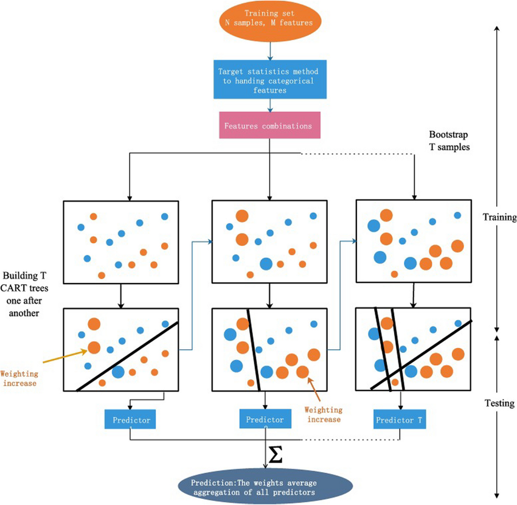
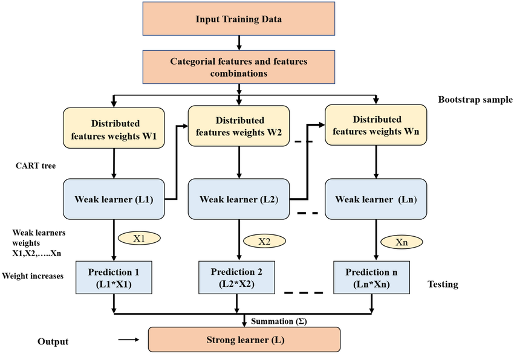
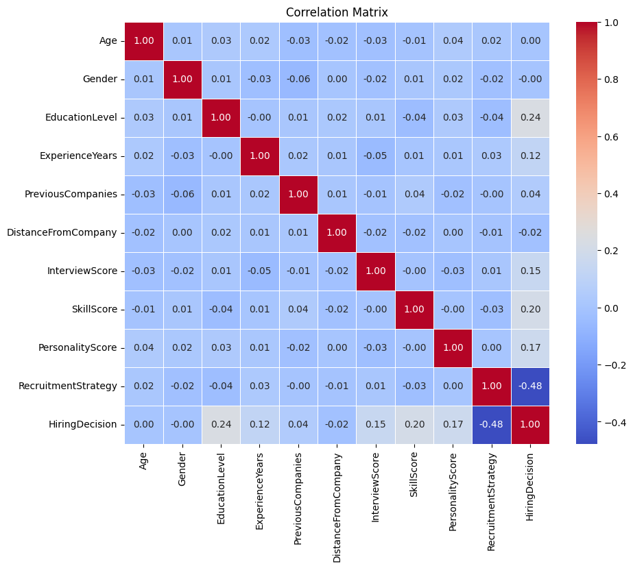
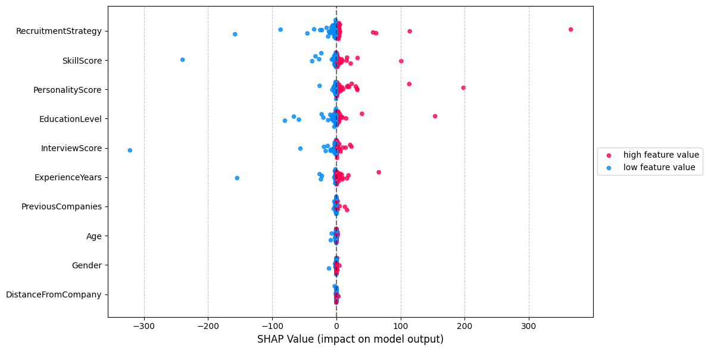
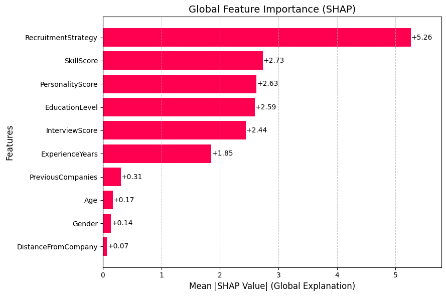
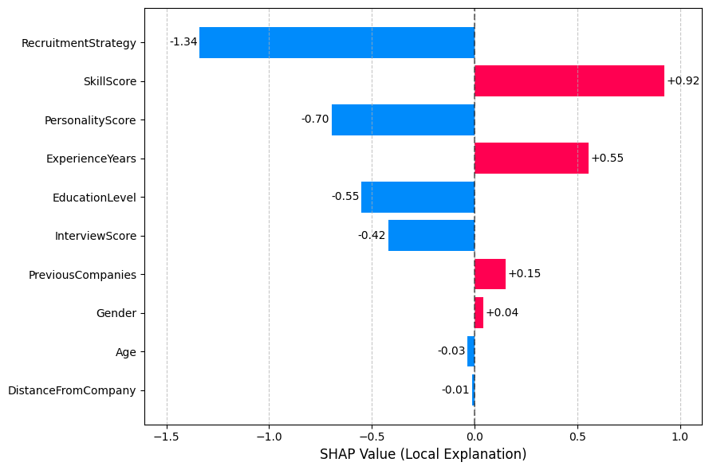
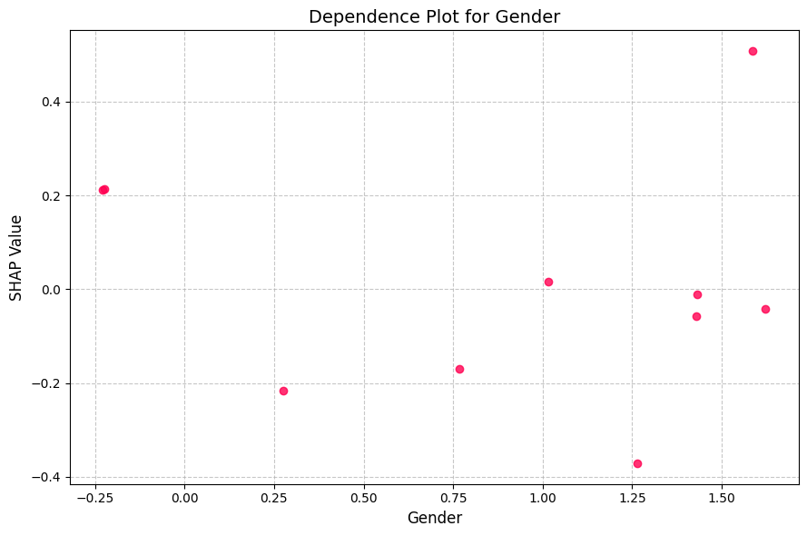
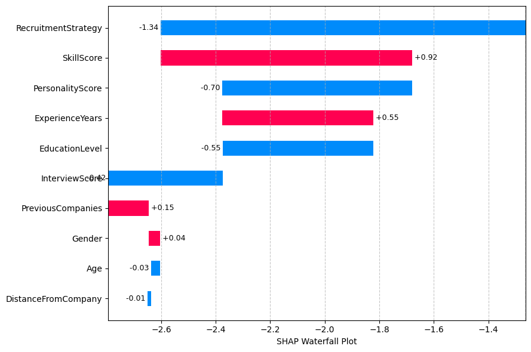
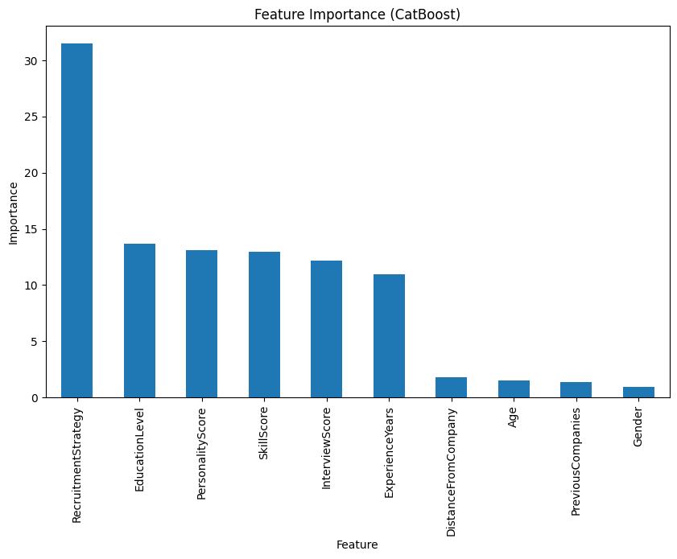

# Building Explainable Hiring Models with CatBoost and SHAP

*Authors: Amir Nigmatullin (am.nigmatullin@innopolis.university) and Nurislam Zinnatullin (n.zinnatullin@innopolis.university)*

In today’s AI-driven world, building models that not only perform well but also provide transparent, understandable insights is critical—especially in sensitive domains such as hiring. This post explains how we combined the power of CatBoost with SHAP (Shapley Additive Explanations) to build an explainable recruitment system.

---

## Table of Contents

1. [Introduction](#introduction)
2. [CatBoost: Architecture and Advantages](#catboost-architecture-and-advantages)
3. [Understanding SHAP and Shapley Values](#understanding-shap-and-shapley-values)
    - [Shapley Values from Game Theory](#shapley-values-from-game-theory)
    - [SHAP in Machine Learning](#shap-in-machine-learning)
4. [Efficient Approximation of Shapley Values](#efficient-approximation-of-shapley-values)
    - [Kernel SHAP (KernelExplainer)](#kernel-shap-kernelexplainer)
    - [SamplingExplainer](#samplingexplainer)
    - [Tradeoffs and Practical Considerations](#tradeoffs-and-practical-considerations)
5. [Our Recruitment Model: Case Study](#our-recruitment-model-case-study)
6. [Key Insights and Recommendations](#key-insights-and-recommendations)

---

## 1. Introduction

Explainable AI (XAI) is transforming how we build and trust machine learning models by shedding light on their decision-making processes. In hiring, where biases and opaque decisions can have serious legal and ethical implications, explainability is essential. Our goal is to develop a model aligned with HR experts’ decision-making while providing clear insights into its predictions using SHAP.

---

## 2. CatBoost: Architecture and Advantages

CatBoost, developed by Yandex, is a high-performance gradient boosting algorithm especially suited for handling categorical data. Its **ordered boosting** technique efficiently encodes categorical variables, which is critical in our recruitment dataset that includes features such as *Age, Gender, EducationLevel, ExperienceYears, InterviewScore, SkillScore, PersonalityScore,* and *RecruitmentStrategy*.

### Key Features
- **Efficient Handling of Categorical Data:**  
  Ordered boosting enables direct processing of categorical features, enhancing both training speed and prediction accuracy.
  
- **Robust Model Performance:**  
  CatBoost’s architecture supports both classification and regression tasks, making it a versatile tool in various applications.

*Visual representations of the CatBoost architecture and decision-making process can further illustrate these points.*

---

## 3. Understanding SHAP and Shapley Values

SHAP is a state-of-the-art method that explains model predictions by quantifying the contribution of each feature. Its foundation lies in Shapley values from cooperative game theory.

### Shapley Values from Game Theory

Originally proposed by Lloyd Shapley in 1953, Shapley values were designed to fairly distribute a total payoff among players in a cooperative game. In our context:
- **Players:** The features of the model.
- **Payoff:** The prediction outcome.

The Shapley value for a feature *i* is calculated as:

$$
\phi_i = \sum_{S \subseteq N \setminus \{i\}} \frac{|S|! \, (|N| - |S| - 1)!}{|N|!} \left[ f(S \cup \{i\}) - f(S) \right]
$$

Where:
- *N* is the set of all features.
- *S* is any subset excluding feature *i*.
- *f(S)* is the model prediction using subset *S*.
- The factorial terms account for all possible inclusion orders.

### SHAP in Machine Learning

SHAP leverages these values to provide explanations for individual predictions as well as overall model behavior. Its key properties include:

- **Additivity:**  
  Model predictions can be decomposed as a sum of a baseline value and individual SHAP values:

  $$
  f(x) = \phi_0 + \sum_{i=1}^{n} \phi_i
  $$

- **Fairness:**  
  Features with similar contributions receive similar SHAP values.
  
- **Zero Importance:**  
  Features that do not affect the prediction have SHAP values close to zero.

This interpretability allows us to see not just the magnitude, but also the direction of each feature’s influence on the model’s output.

---

## 4. Efficient Approximation of Shapley Values

Calculating exact Shapley values is computationally expensive due to the need to evaluate all possible subsets of features (exponential in number). To overcome this, approximation methods are used.

### Kernel SHAP (KernelExplainer)

Kernel SHAP approximates Shapley values via weighted linear regression on a subset of feature coalitions.

**How It Works:**
- **Coalition Sampling:**  
  Instead of evaluating all \(2^M\) subsets, it samples a limited number (using a parameter like `max_samples`) with weights determined by the Shapley kernel:
  
  $$
  w(S) = \frac{M-1}{\binom{M}{|S|} \, |S| \, (M-|S|)}
  $$

- **Background Data Integration:**  
  It creates masked instances that blend the target observation with a set of background samples.
  
- **Regression:**  
  Solves for SHAP values that best explain the difference in predictions.

*This reduces the complexity from \(O(2^M)\) to \(O(T \cdot M)\), where \(T\) is the number of samples.*

### SamplingExplainer

SamplingExplainer uses feature perturbation and averaging over background data to estimate feature contributions more quickly.

**Key Steps:**
1. **Baseline Prediction:**  
   Compute average predictions using background data.
2. **Perturbation Analysis:**  
   Replace each feature value with the target instance’s value in background samples, and measure prediction changes.
3. **Normalization:**  
   Ensure that the sum of the contributions matches the difference between the instance’s prediction and the baseline.

*Its complexity scales linearly with the number of features and background samples, making it suitable for high-dimensional data.*

### Tradeoffs and Practical Considerations

| **Method**           | **Strength**                         | **Limitation**                     |
|----------------------|--------------------------------------|------------------------------------|
| **KernelExplainer**  | Theoretically robust                 | Slower on high-dimensional data    |
| **SamplingExplainer**| Faster and well-suited for classification | Assumes feature independence       |

---

## 5. Our Recruitment Model: Case Study

We applied our approach to build an autonomous hiring system using historical HR data. Our model is based on CatBoost, chosen for its excellence in handling categorical data.

### Model Performance Metrics

- **Accuracy:** 95.67%
- **ROC AUC Score:** 94.13%
- **Classification Report:**
  - **Class 0:** Precision 96%, Recall 98%, F1-score 97% (Support: 215)
  - **Class 1:** Precision 94%, Recall 91%, F1-score 92% (Support: 85)

### Feature Analysis

While our EDA we found key predictors that were highly correlated with hiring decisions:

RecruitmentStrategy, EducationLevel, SkillScore, PersonalityScore, and ExperienceYears

### **Beeswarm plot**: 

A SHAP beeswarm plot visualizes the distribution and impact of each feature's SHAP values across all predictions, showing feature importance (vertical order) and effect direction (red/blue for positive/negative influence). It helps identify key drivers of model behavior while revealing nonlinear patterns and outliers in feature contributions.

### **Bar plot (Global)**: 

The SHAP bar plot ranks features by their average impact (mean absolute SHAP values), showing which features most influence the model's predictions across all data.

### **Bar plot (Local)**: 

For a single prediction, it displays each feature's exact contribution (positive/negative SHAP value), explaining how they pushed the prediction higher or lower than the baseline.

### **Dependence plot**: 

The dependence plot shows how the impact of feature varies across different values, revealing non-linear relationships not captured by simple correlation

### **Waterfall plot**: 

The waterfall plot for a specific candidate shows how each feature contributed to their final prediction, providing transparency for individual decisions

### Build-in Feature importance by CatBoost

Visual plots from both SHAP approaches and the built-in CatBoost feature importance revealed consistent insights, aligning well with our initial exploratory data analysis.

---

## 6. Key Insights and Recommendations

### Insights
- **Strategic Hiring:**  
  Aggressive recruitment strategies can significantly influence hiring outcomes.
  
- **Candidate Evaluation:**  
  Educational background and technical skills are strong predictors.
  
- **Fairness:**  
  The model shows minimal bias based on demographic features like age and gender.
  
- **Transparency:**  
  XAI techniques such as SHAP enhance trust by explaining the model’s predictions both globally and locally.

### Recommendations for Business
1. **Adjust Recruitment Strategies:**  
   Align strategies with market conditions and organizational needs.
2. **Focus on Predictive Factors:**  
   Prioritize education and skills in candidate evaluation.
3. **Continuous Monitoring:**  
   Regularly audit the model using SHAP to maintain fairness and accuracy.
4. **Embrace Interpretability:**  
   Incorporate explainability into all high-stakes decision-making systems to ensure transparency and accountability.

---

By integrating CatBoost and SHAP, we not only achieve high model performance but also offer deep insights into the decision-making process. This dual focus on accuracy and interpretability supports fair and informed HR practices, making it a powerful approach for modern recruitment systems.
