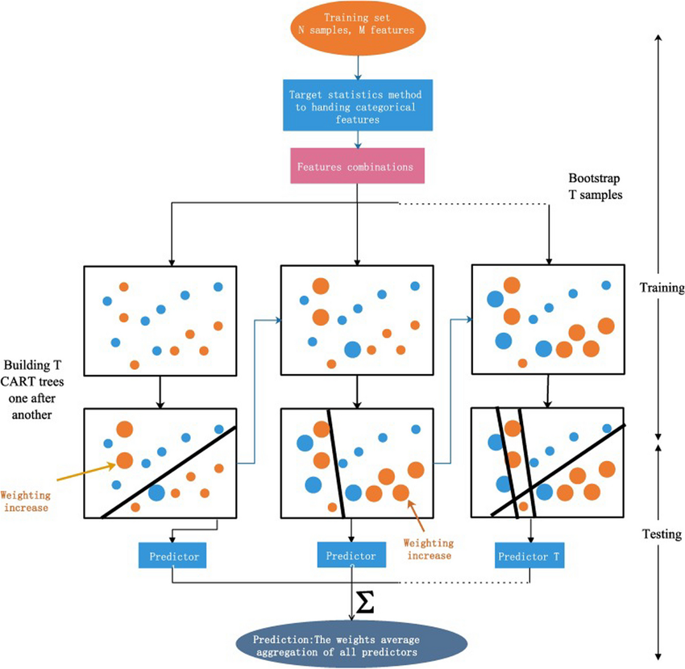
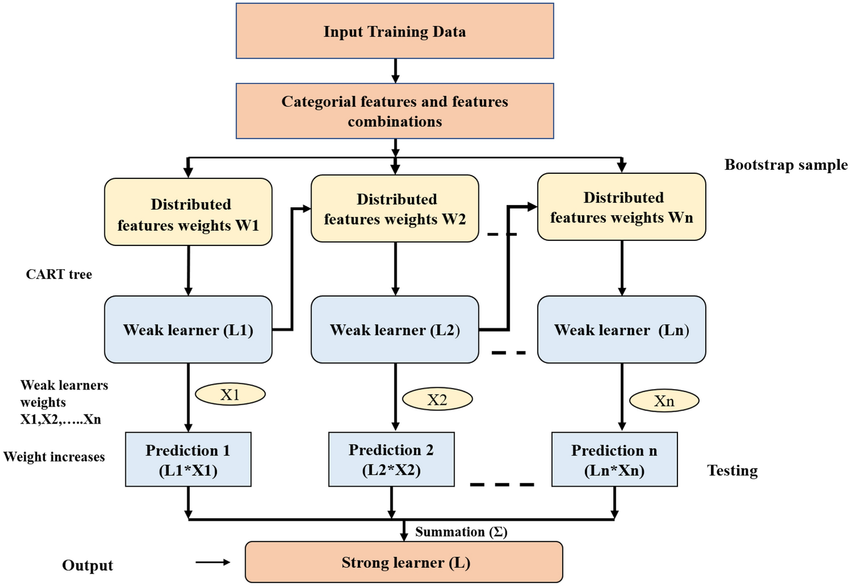
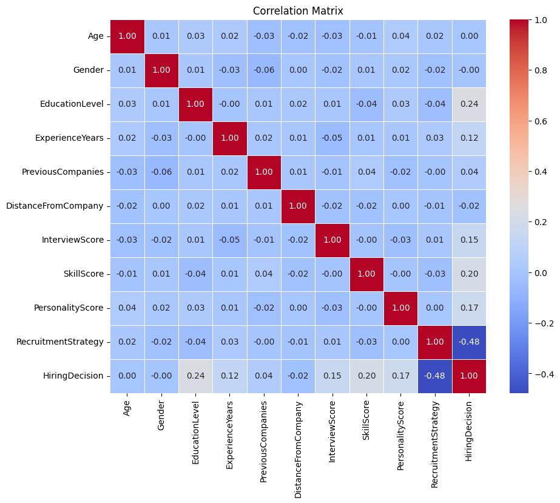
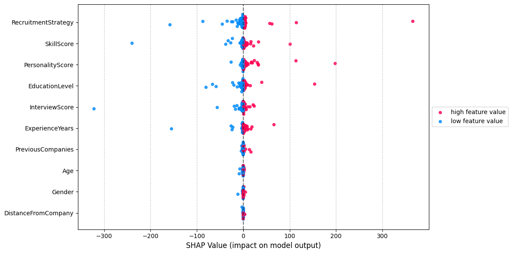
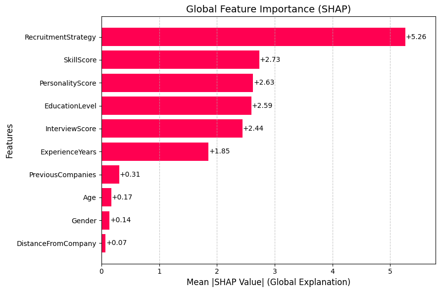
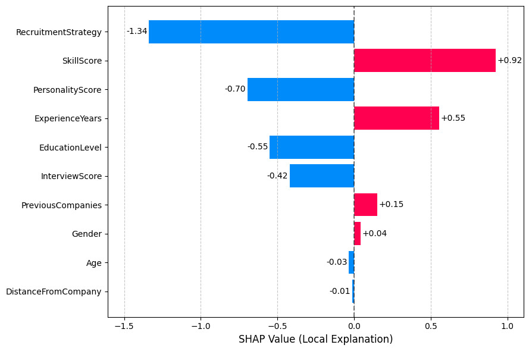
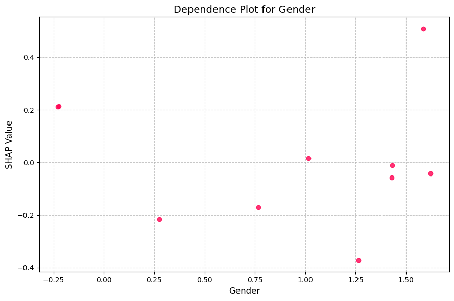
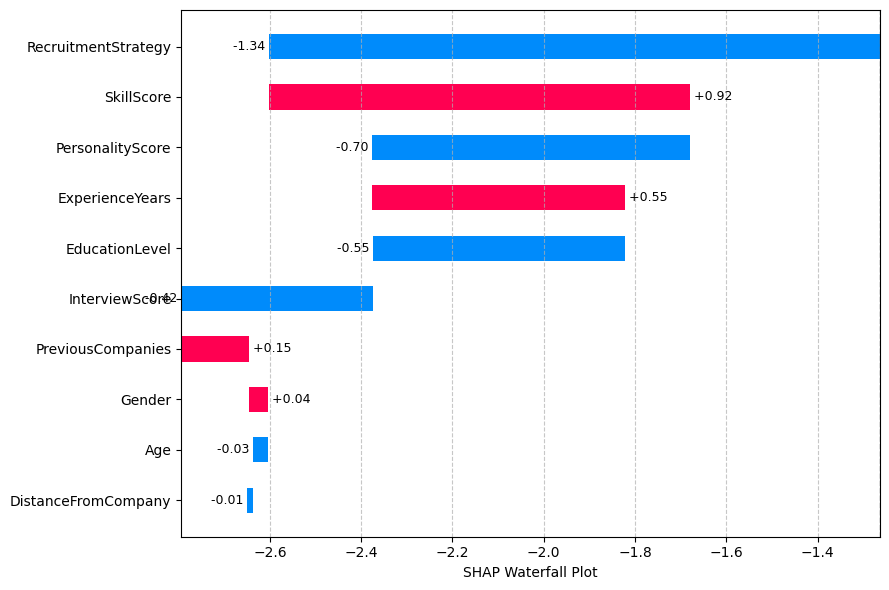
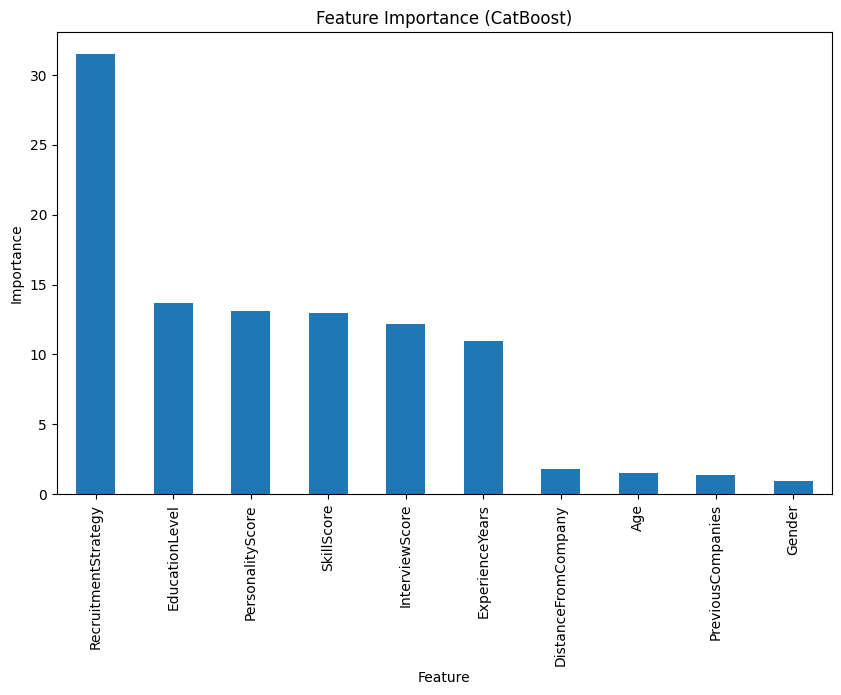

# Building Explainable Hiring Models with CatBoost and SHAP

*Authors: Amir Nigmatullin (am.nigmatullin@innopolis.university) and Nurislam Zinnatullin (n.zinnatullin@innopolis.university)*

---

## Table of Contents

1. [Introduction](#1-introduction)
2. [CatBoost: Architecture and Advantages](#2-catboost-architecture-and-advantages)
3. [Understanding SHAP and Shapley Values](#3-understanding-shap-and-shapley-values)
    - [Shapley Values from Game Theory](#shapley-values-from-game-theory)
    - [SHAP in Machine Learning](#shap-in-machine-learning)
4. [Efficient Approximation of Shapley Values](#4-efficient-approximation-of-shapley-values)
    - [Kernel SHAP (KernelExplainer)](#kernel-shap-kernelexplainer)
    - [Sampling-Based Approximation (SamplingExplainer)](#sampling-based-approximation-samplingexplainer)
    - [Tradeoffs and Practical Considerations](#tradeoffs-and-practical-considerations)
5. [Our Recruitment Model: Case Study](#5-our-recruitment-model-case-study)
6. [Key Insights and Recommendations](#6-key-insights-and-recommendations)

---

## 1. Introduction

Explainable Artificial Intelligence (XAI) has become a fundamental area of AI research, striving to improve the transparency and interpretability of machine learning models. Understanding how AI systems make decisions is crucial for fostering trust, ensuring accountability, and mitigating potential risks.

In this post, we focus on the application of AI in hiring decisions, where biased models can pose significant legal, ethical challenges, and money loss in future. By leveraging the expertise of HR specialists, we can train a model that aligns with their decision-making processes. To enhance interpretability, we propose using SHAP (Shapley Additive Explanations) to estimate the factors influencing predictions. Specifically, we will explore the use of the CatBoost classifier to ensure accurate and explainable hiring decisions

---

## 2. CatBoost: Architecture and Advantages

CatBoost, a state-of-the-art algorithm developed by Yandex, is a powerful solution for efficient and accurate machine learning tasks, including classification and regression. With its innovative Ordered Boosting technique, CatBoost enhances predictive performance by leveraging decision trees effectively.



A major advantage of CatBoost is its efficient handling of categorical features. It utilizes a unique approach known as "ordered boosting," which enables the model to process categorical data directly. This method enhances training speed and boosts model accuracy by encoding categorical variables while maintaining their inherent order.



Our dataset was mainly contained of categorical or close to categorical features (Age, Gender, EducationLevel, ExperienceYears, InterviewScore, SkillScore, PersonalityScore, RecruitmentStrategy), therefore we decided to choose CatBoost as a recruitment system model.

---

## 3. Understanding SHAP and Shapley Values

SHAP is a state-of-the-art method that explains model predictions by quantifying the contribution of each feature. Its foundation lies in Shapley values from cooperative game theory.

### Shapley Values from Game Theory

Originally proposed by Lloyd Shapley in 1953, Shapley values were designed to fairly distribute a total payoff among players in a cooperative game. In our context:
- **Players:** The features of the model.
- **Payoff:** The prediction outcome.

The Shapley value for a feature *i* is calculated as:

$$
\phi_i = \sum_{S \subseteq N \setminus \{i\}} \frac{|S|! (|N| - |S| - 1)!}{|N|!} \left[ f(S \cup \{i\}) - f(S) \right]
$$

Where:
- *N* is the set of all features.
- *S* is any subset excluding feature *i*.
- *f(S)* is the model prediction using subset *S*.
- The factorial terms account for all possible inclusion orders.

### SHAP in Machine Learning

SHAP leverages these values to provide explanations for individual predictions as well as overall model behavior. Its key properties include:

- **Additivity:**  
  Model predictions can be decomposed as a sum of a baseline value $\phi_0$ and individual SHAP values $\phi_i$:

$$
f(x) = \phi_0 + \sum_{i=1}^{n} \phi_i
$$

  Suppose you trained a random forest, which means that the prediction is an average of many decision trees. The Additivity property guarantees that for a feature value, you can calculate the Shapley value for each tree individually, average them, and get the Shapley value for the feature value for the random forest.

- **Fairness:**  
  Features with similar contributions receive similar SHAP values.
  
- **Zero Importance:**  
  Features that do not affect the prediction have SHAP values close to zero.

---

## 4. Efficient Approximation of Shapley Values

Calculating exact Shapley values is computationally expensive due to the need to evaluate all possible subsets of features (exponential in number). To overcome this, approximation methods are used.

### Kernel SHAP (KernelExplainer)

Kernel SHAP approximates Shapley values via weighted linear regression on a subset of feature coalitions.

**How It Works:**
- **Coalition Sampling:**  
  Instead of evaluating all \(2^M\) subsets, it samples a limited number (using a parameter like `max_samples`) with weights determined by the Shapley kernel:
  
$$
w(S) = \frac{M-1}{\binom{M}{|S|} |S| (M-|S|)}
$$

  This prioritizes small (1-2 features) and large (M-1 to M-2 features) coalitions, which carry the highest information value.

- **Background Data Integration:**  
  For each coalition, creates masked instances by blending the target observation's features with `background_data` (typically 10-100 samples). Predictions on these hybrid instances approximate $f(S \cup i)$ and $f(S)$.
  
- **Regression:**  
  Uses weighted linear regression to solve for Shapley values that best explain the prediction differences:

$$
\min_{\phi} \sum_{S} w(S) [f(S) - (\phi_0 + \sum_{i∈S}\phi_i)]²
$$

This reduces the complexity from $O(2^M)$ to $O(T \cdot M)$, where $T$ is the number of samples.

### Sampling-Based Approximation (SamplingExplainer)

SamplingExplainer uses *feature perturbation* and *averaging over background data* to estimate feature contributions more quickly.

**Key Steps:**
1. **Baseline Prediction:**  
   Compute average predictions using background data.
2. **Perturbation Analysis:**  
  For each feature in the target instance:
    - Replace the feature's value in all background samples with the instance's value
    - Compute prediction deltas in log-odds space
    - Average deltas across background samples as the feature's contribution
3. **Additivity Enforcement:**  
   Rescales contributions to ensure:

  $$
  \sum\phi_i = f(x) - E[f]
  $$

  This preserves SHAP's local accuracy guarantee.

Complexity scales as ${O(B·M)}$ where ${B}$ is background samples (typically 100-1000). For 100 features, this requires ~1e4 operations vs. 1e30 for exact computation.

### Tradeoffs and Practical Considerations

| **Method**           | **Strength**                         | **Limitation**                     |
|----------------------|--------------------------------------|------------------------------------|
| **KernelExplainer**  | Theoretically robust                 | Slower on high-dimensional data    |
| **SamplingExplainer**| Faster and well-suited for classification | Assumes feature independence       |

---

## 5. Our Recruitment Model: Case Study

We applied our approach to build an autonomous hiring system using historical HR data. Our model is based on CatBoost, chosen for its excellence in handling categorical data.

### Model Performance Metrics

```
Accuracy:
 0.9566666666666667 

ROC AUC Score:
 0.941313269493844 

Classification Report:
               precision    recall  f1-score   support

           0       0.96      0.98      0.97       215
           1       0.94      0.91      0.92        85

    accuracy                           0.96       300
   macro avg       0.95      0.94      0.95       300
weighted avg       0.96      0.96      0.96       300
```

### Feature Analysis

While our EDA we found key predictors that were highly correlated with hiring decisions:



RecruitmentStrategy, EducationLevel, SkillScore, PersonalityScore, and ExperienceYears


### **Beeswarm plot**: 

A SHAP beeswarm plot visualizes the distribution and impact of each feature's SHAP values across all predictions, showing feature importance (vertical order) and effect direction (red/blue for positive/negative influence). It helps identify key drivers of model behavior while revealing nonlinear patterns and outliers in feature contributions.



### **Bar plot (Global)**: 

The SHAP bar plot ranks features by their average impact (mean absolute SHAP values), showing which features most influence the model's predictions across all data.



### **Bar plot (Local)**: 

For a single prediction, it displays each feature's exact contribution (positive/negative SHAP value), explaining how they pushed the prediction higher or lower than the baseline.



### **Dependence plot**: 

The dependence plot shows how the impact of feature varies across different values, revealing non-linear relationships not captured by simple correlation



### **Waterfall plot**: 

The waterfall plot for a specific candidate shows how each feature contributed to their final prediction, providing transparency for individual decisions




### Build-in Feature importance by CatBoost

Visual plots from both SHAP approaches and the built-in CatBoost feature importance revealed consistent insights, aligning well with our initial exploratory data analysis.



### Why not use only CatBoost feature importance?

It shows average magnitude of feature impact across the dataset

SHAP values provide detailed feature contributions for each prediction, showing both magnitude and direction

---

## 6. Key Insights and Recommendations

### Insights
- **Strategic Hiring:**  
  Aggressive recruitment strategies can significantly influence hiring outcomes.
  
- **Candidate Evaluation:**  
  Educational background and technical skills are strong predictors.
  
- **Fairness:**  
  The model shows minimal bias based on demographic features like age and gender.
  
- **Transparency:**  
  XAI techniques such as SHAP enhance trust by explaining the model’s predictions both globally and locally.

### Recommendations for Business
1. **Adjust Recruitment Strategies:**  
   Align strategies with market conditions and organizational needs.
2. **Focus on Predictive Factors:**  
   Prioritize education and skills in candidate evaluation.
3. **Continuous Monitoring:**  
   Regularly audit the model using SHAP to maintain fairness and accuracy.
4. **Embrace Interpretability:**  
   Incorporate explainability into all high-stakes decision-making systems to ensure transparency and accountability.

---

By integrating CatBoost and SHAP, we not only achieve high model performance but also offer deep insights into the decision-making process. This dual focus on accuracy and interpretability supports fair and informed HR practices, making it a powerful approach for modern recruitment systems.
